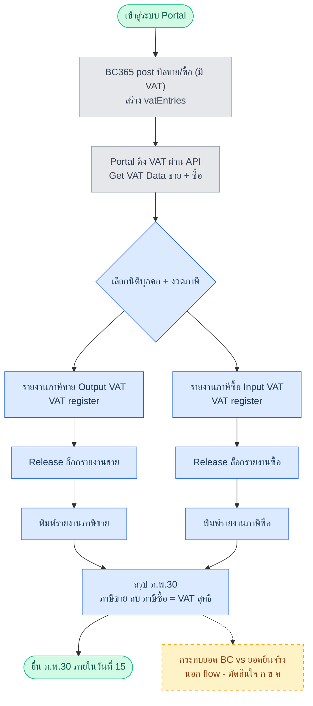

# Finance Flow Understanding (2026-05-29)

อ่าน flow PDF จริง: Finance/Flow (Cash Receive, Payment, Bank Recon) + Account/Flow (AR, AP, GJ, VAT, WHT) + Data Transfer (6). ทำตามกฎ flow-first ก่อนแตะ mockup. Canonical = flow + spec (ADR-0001).

## ข้อค้นพบสำคัญที่สุด: "Account flow" หลายตัว ไม่ใช่หน้าของ FI module

flow ในโฟลเดอร์ `Account/` คือ **ต้นทางการสร้างเอกสาร** ไม่ใช่งานการเงิน — เจ้าของจริงคือ Sales/Purchase:

| Account flow | จริงๆ คือ | เจ้าของหน้า | สถานะ |
|---|---|---|---|
| AR (01) | post บิลขาย → ตั้งลูกหนี้ | **SL-4** (Sales) | มีแล้ว (sl4-invoice) |
| AP (03) | สร้าง+อนุมัติ+post บิลซื้อ | **PO-6** + ap1 (Approval) | มีแล้ว (po6-ap-invoice) |
| ARCN (02) | สร้าง+post ใบลดหนี้ขาย | **SL ใหม่ (SL-CN)** | ❌ ไม่มี (= gap เดียวกับที่เจอใน Sales) |
| APCN (04) | สร้าง+อนุมัติ+post ใบลดหนี้ซื้อ (มี Approval) | **PO ใหม่ (PO-CN)** | ❌ ไม่มี |

⇒ FI module ที่แท้จริง = งานรับ/จ่าย/กระทบยอด/ภาษี/โอนห้องภาษี เท่านั้น ไม่ใช่การออกบิล

## FI module — flow จริง → touchpoint → เลขที่ถูกต้อง

| เลขที่ถูก (spec) | หน้า (canonical) | flow touchpoint ฝั่ง Portal | Phase | ไฟล์ปัจจุบัน | Action |
|---|---|---|---|---|---|
| **FI-1** | AR รับเงินลูกหนี้ | เลือก Posted Sales Invoice → Cash Receive + payment method → Apply → ออก CRV → Post | P1 | fi1-ar-receive | ✅ ถูกต้อง |
| **FI-1Q** | Apply Queue (auto-match QR/bank) | feed อัตโนมัติ → URC → จับคู่ → Apply | P1 | fi1q-apply-queue | ✅ ถูกต้อง |
| **FI-2** | AP จ่ายเจ้าหนี้ (+WHT capture) | เลือก Posted Purchase Invoice → Payment+WHT (Open) → **Approval** → method → Apply → ออก PV → Post → Print/PND | P1 | fi2-ap-payment | ⚠️ ต้องโชว์ Approval gate (→ap1) + ลิงก์ WHT print (FI-12) |
| **FI-3** | **กระทบยอดธนาคาร (Bank Recon)** | เลือก Bank Code → Import Statement → Matching → Adjust → Post → Bank Ledger | P1 | — | 🔴 **ต้องสร้างใหม่ (gap)** |
| **FI-4** | **General Journal / JV** | บันทึก JV → Check Balance → Post → G/L (flow นี้ BC-direct เกือบหมด) | P1 | — | 🔴 **สร้าง หรือ cut-to-BC (ต้องตัดสินใจ)** |
| **FI-5** | Expense Voucher | สร้างใบสำคัญค่าใช้จ่าย + WHT capture | P2 | fi4-expense-wht *(ติดป้าย FI-4 ผิด)* | 🔧 re-code fi4 → FI-5, ส่งงาน WHT filing ให้ FI-12 |
| **FI-7** | รายงาน VAT ภาษีขาย/ซื้อ (→ภ.พ.30) | List VAT ตามงวด → Release → Print | P1 ตาม flow *(spec เขียน P3 — ขัดกัน)* | fi3-tax-reconciliation *(ติดป้าย FI-3 ผิด)* | 🔧 re-code fi3 → FI-7, แยก WHT ออก |
| **FI-12** | **WHT List (ใบรับรอง + ภ.ง.ด.3/53)** | List จาก Payment Journal → Release → Print Cert/ภ.ง.ด. | P1 | กระจายอยู่ใน fi3+fi4 | 🔴 **รวมเป็นหน้าเดียว** |
| **FI-13** | Dual-Book โอนห้องภาษี (6 legs) | ดูด้านล่าง | P3 | fi13-dual-book | 🔧 เสริม transfer engine |
| FI-6? | Credit Control | — | — | fi5-ar-audit *(excess ไม่มี flow)* | 🔧 re-scope → FI-6 หรือยุบเข้า fiq |

## FI-13 Dual-Book = Data Transfer 6 legs (ห้องหลัก → ห้องภาษี)

ทั้ง 6 flow คือขาเดียวกันของ FI-13: (01) บิลขาย (02) ใบลดหนี้ขาย (03) รับเงิน (04) บิลซื้อตาม Entity Tag (05) ใบลดหนี้ซื้อ (06) จ่ายเงิน+WHT. กลไกจริง = Flag/Mark เอกสารที่ post แล้ว → Select Company → Generate temp → Post เข้าบริษัทผ่าน API. mockup fi13 สื่อ concept ห้องหลัก/ห้องภาษี + บิลทิ้ง ถูก แต่ยังไม่ model ตัว engine + ยังไม่มี row type CN/receipt/payment. Entity Tag set ที่ PO-6 (ต้องตรวจว่ามี field required).

## P1 Gaps (ของจริงที่หายเพราะเลขเพี้ยน)
1. **FI-3 Bank Reconciliation** — ไม่มีหน้า (ช่อง FI-3 ถูก tax-recon ยึด)
2. **FI-4 General Journal/JV** — ไม่มีหน้า (ช่อง FI-4 ถูก expense-wht ยึด) — *แต่ flow BC-direct → ต้องตัดสินใจ Portal vs cut-to-BC*
3. **FI-12 WHT List** — ไม่มีหน้าเดียว (กระจาย fi3+fi4)
4. **SL-CN / PO-CN** — ใบลดหนี้ขาย/ซื้อ ไม่มีหน้า (อยู่คนละ module แต่เป็น gap)

## FI-7 รายงาน VAT — flow diagram (อ่านจาก Account/Flow/06, confirm P1)

หมายเหตุ: PDF สลับป้าย ภาษีขาย/ซื้อ — ยึดความหมายถูก (Sales=output/ขาย, Purchase=input/ซื้อ). REC (กระทบยอด) = นอก flow รอ user ตัดสิน ก/ข/ค.

## เปิดประเด็นให้ user ตัดสิน
- FI-4 JV: Portal ทำ thin UI หรือ cut-to-BC (เหมือน CF-2.3)?
- FI-7 VAT: flow วาดเป็น P1 แต่ spec เขียน P3 — ยึดอันไหน?
- VAT+WHT ที่ตอนนี้รวมหน้าเดียว (fi3): แยกเป็น FI-7 (VAT) + FI-12 (WHT) ตาม flow ใช่ไหม?
